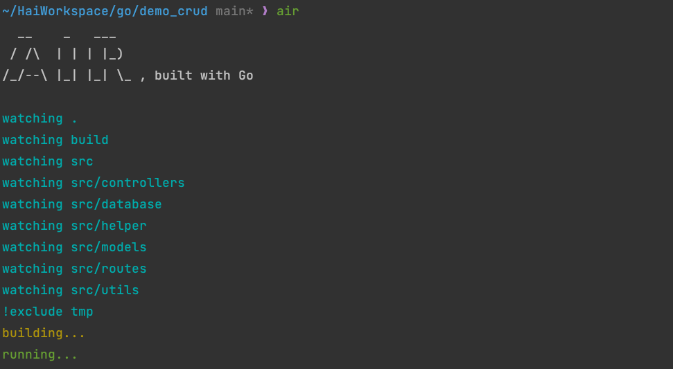

# Golang Demo API

[](https://go.dev/)
[](https://github.com/gin-gonic/gin)
[](https://github.com/go-gorm/gorm)
[](https://www.docker.com/)

This repository contains CRUD example
demonstrate connect database, find data, create, update and delete

### Clone the project

```
$ git https://github.com/solvntech/golang_curd.git
$ cd golang_curd
```

### Config environment

_Create `.env` file and copy `.env.example` to `.env`, after that modify according your configuration_

Example:

```.dotenv
POSTGRES_USER=postgres
POSTGRES_PASSWORD=your_db_pass
POSTGRES_DB_HOST=localhost
POSTGRES_PORT=5432
POSTGRES_DB=db_name
```

### Setup docker

```
$ docker compose up -d
```

### Install dev environment and run project

```
# install live host server at global

$ go install github.com/cosmtrek/air@latest

# install dependencies

$ go mod download && go mod tidy

# run project

$ air
```


